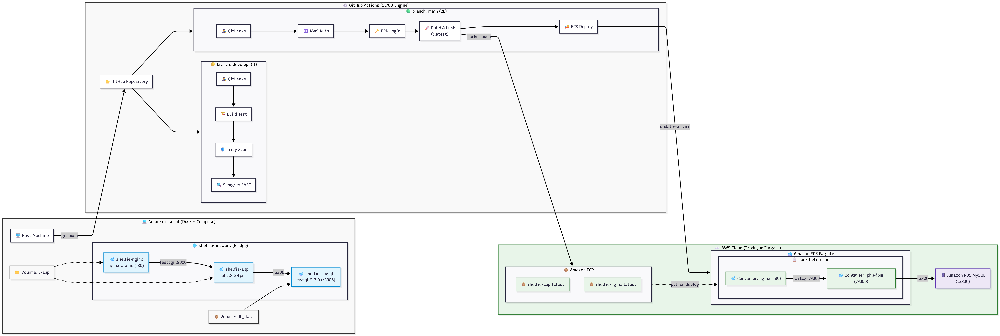

# Shelfie — Deploy Completo com CI/CD na AWS

Projeto pessoal de estudo com foco em containerização, deploy em nuvem e automação com CI/CD.  
A aplicação é um gerenciador de estante de livros com autenticação, CRUD completo e estatísticas de leitura.

---

## Stack

| Tecnologia | Função |
|---|---|
| PHP 8.2 + Nginx | Aplicação |
| MySQL 9.7 | Banco de dados local |
| Docker & Docker Compose | Containerização e orquestração local |
| Amazon ECR | Registry de imagens |
| Amazon ECS | Orquestração de containers na nuvem |
| Amazon RDS | Banco de dados gerenciado |
| GitHub Actions | Pipeline CI/CD |
| Trivy | Scan de vulnerabilidades nas imagens Docker (DevSecOps) |
| Semgrep | análise estática de código (SAST)|
---


# 🏗️ Arquitetura Geral do Ecossistema

Para garantir um ciclo de desenvolvimento moderno, seguro e escalável, o projeto **Shelfie** foi desenhado separando as responsabilidades entre o ambiente de desenvolvimento local (Docker Compose) e o ambiente de produção serverless na nuvem.



---

### Estratégia de Branching (GitFlow)

A esteira de automação é orientada ao comportamento das branches do repositório, garantindo que nenhum código quebre a produção:

| Branch | Pipeline | Escopo | Ação |
|---|---|---|---|
| `develop` | `ci.yml` | Integração Contínua (CI) | Build de teste, scans de segurança, linters e validações de código — **Sem deploy**. |
| `main` | `deploy.yml` | Entrega Contínua (CD) | Scan de segurança, build, push para o Amazon ECR e **Deploy automático no ECS Fargate**. |

**Fluxo de Trabalho:**
`develop` ➔ *Pull Request (Aprovação)* ➔ `main` ➔ *Deploy em Produção (AWS)*

## Esteira de Integração e Entrega Contínua (CI/CD)

O fluxo de implantação automatizada (GitOps) na branch principal segue o pipeline linear e seguro detalhado abaixo:


### Práticas de DevSecOps Aplicadas no Pipeline:
* **Scan de Secrets:** Utilização do `GitLeaks` para impedir o vazamento de chaves AWS e credenciais no histórico do Git.
* **Análise de Vulnerabilidades (SCA):** `Trivy Scan` bloqueando o build caso as imagens base do PHP ou Nginx contenham vulnerabilidades de nível *CRITICAL* ou *HIGH*.
* **Análise Estática de Código (SAST):** `Semgrep` validando as boas práticas do código PHP contra o OWASP Top 10 antes do deploy.


---

## Fase 1 — Containerização com Docker

A aplicação originalmente rodava em XAMPP com phpMyAdmin. O objetivo desta fase foi containerizá-la do zero utilizando Docker puro.

### Arquitetura local

```
┌─────────────┐       ┌─────────────┐       ┌─────────────┐
│    Nginx     │──────▶│  PHP-FPM    │──────▶│    MySQL    │
│  (proxy)    │       │   (app)     │       │    (db)     │
│   porta 80  │       │  porta 9000 │       │  porta 3306 │
└─────────────┘       └─────────────┘       └─────────────┘
                        shelfie-network
```

### O que foi feito

- Dockerfile com imagem `php:8.2-fpm-alpine`, instalação de `pdo_mysql`, usuário não-root (`appuser`) com least privilege e healthcheck via `php-fpm -t`
- Docker Compose orquestrando 3 serviços: `nginx`, `app` e `db`
- Rede interna `shelfie-network` isolando os containers
- Volume nomeado `db_data` para persistência do MySQL
- Healthcheck no MySQL com `mysqladmin ping` e `start_period` para evitar race condition na inicialização
- `depends_on` com `condition: service_healthy` garantindo ordem de subida: `db → app → nginx`
- Variáveis de ambiente via `.env` — credenciais fora do código
- Porta do banco não exposta externamente
- Schema e seed do banco via `init.sql` executado automaticamente na inicialização do container

---

## Fase 2 — Amazon ECR

As imagens Docker foram enviadas para o Amazon ECR para serem utilizadas pelo ECS.

Dois repositórios criados:
- `isaquesebastiao/shelfie-app` — imagem PHP-FPM
- `isaquesebastiao/shelfie-nginx` — imagem Nginx


---

## Fase 3 — Amazon ECS Fargate

A aplicação foi deployada no Amazon ECS utilizando AWS Fargate como infraestrutura, eliminando a necessidade de gerenciar servidores EC2.

### Configuração

- **Cluster:** `shelfie-cluster`
- **Task Definition:** `shelfie-task` com dois containers (`shelfie-nginx` + `shelfie-app`)
- **CPU:** 0.5 vCPU | **Memória:** 1GB
- **Subnets:** públicas da VPC existente
- **Security Group:** porta 80 liberada para `0.0.0.0/0`
- **IP público:** habilitado

### Problema Encontrado Durante o Deploy no ECS

Durante o deploy da aplicação PHP no Amazon ECS utilizando AWS Fargate, a aplicação não respondia ao acessar o IP público da Task.

Inicialmente, apenas o container da aplicação PHP (`php:8.2-fpm-alpine`) foi enviado para o Amazon ECR e utilizado na Task Definition. O problema é que o `php-fpm` não funciona como servidor web HTTP — ele apenas processa arquivos PHP internamente.

No ambiente local, a aplicação funcionava corretamente porque o Docker Compose utilizava dois containers: Nginx e PHP-FPM. O Nginx era responsável por receber as requisições HTTP e encaminhá-las para o PHP-FPM. No ECS, como apenas o container PHP foi utilizado, não existia nenhum servidor web para responder às requisições externas.

A solução foi ajustar a arquitetura para utilizar dois containers na mesma Task Definition: `shelfie-nginx` e `shelfie-app`. O container Nginx passou a expor a porta `80`, enquanto o container PHP-FPM permaneceu utilizando a porta `9000`.

Também foi necessário ajustar a configuração do Nginx. Inicialmente, o arquivo `default.conf` utilizava:

```nginx
fastcgi_pass app:9000;
```

Essa configuração funcionava no Docker Compose devido ao DNS interno automático do Compose. Porém, no ECS esse hostname não existia. A solução foi alterar para:

```nginx
fastcgi_pass 127.0.0.1:9000;
```

Como os containers da mesma Task compartilham a rede no ECS, o Nginx conseguiu se comunicar corretamente com o PHP-FPM através do localhost. Após recriar a imagem do Nginx, realizar novo push para o Amazon ECR e atualizar a Task Definition no ECS, a aplicação passou a responder corretamente via navegador.


---

## Fase 4 — Amazon RDS MySQL

O banco de dados foi migrado do container local para o Amazon RDS, tornando-o um serviço gerenciado e independente dos containers.

### Configuração

- **Engine:** MySQL 8.4
- **Instância:** db.t3.micro (free tier)
- **VPC:** mesma VPC do ECS
- **Subnets:** privadas
- **Security Group:** porta 3306 liberada apenas para o Security Group do ECS
- **Publicly accessible:** Yes

### Migração

O `init.sql` com o schema e seed foi executado diretamente no RDS após a criação. A variável `DB_HOST` na Task Definition foi atualizada para o endpoint do RDS:

```
shelfiedb.xxxxxxxxx.us-east-1.rds.amazonaws.com
```


---

## Fase 5 — GitHub Actions (CI/CD)

Pipeline de deploy automatizado configurado para rodar a cada push na branch `main`.

### Fluxo da pipeline


## CI — Validação e Segurança (develop)

```
push na develop → checkout → build imagem PHP → build imagem Nginx →
Trivy scan PHP → Trivy scan Nginx → Semgrep (SAST) → pipeline verde
```
## CD - Deploy ECR e ECS (main)

```
push na main → checkout → configure AWS credentials → login ECR →
build + push imagem PHP → build + push imagem Nginx → force new deployment no ECS
```

### DevSecOps — Semgrep + Trivy

A pipeline de CI possui múltiplas camadas de segurança automatizadas utilizando Semgrep e Trivy.

# Semgrep — SAST

O Semgrep realiza análise estática de código (SAST) no projeto PHP a cada push na branch develop.

As regras utilizadas incluem:

p/php → vulnerabilidades específicas da linguagem PHP
p/secrets → detecção de secrets hardcoded
p/owasp-top-ten → validação baseada no OWASP Top 10

O objetivo é identificar vulnerabilidades e más práticas diretamente no código-fonte antes do build das imagens Docker.

# Trivy — Container Security

Após o build das imagens Docker, o Trivy executa scan automático de vulnerabilidades nas imagens shelfie-app e shelfie-nginx.

A pipeline é bloqueada automaticamente caso sejam encontradas vulnerabilidades classificadas como HIGH ou CRITICAL.

Dessa forma, imagens vulneráveis não são enviadas ao ECR nem chegam ao ambiente de produção.

## GitHub Actions Pipeline


### Secrets configurados no GitHub

| Secret | Descrição |
|---|---|
| `AWS_ACCESS_KEY_ID` | Chave de acesso AWS |
| `AWS_SECRET_ACCESS_KEY` | Chave secreta AWS |
| `AWS_REGION` | Região AWS |
| `ECR_REGISTRY` | URI do registry ECR |
| `ECR_REPOSITORY_APP` | Nome do repositório PHP |
| `ECR_REPOSITORY_NGINX` | Nome do repositório Nginx |
| `ECS_CLUSTER` | Nome do cluster ECS |
| `ECS_SERVICE` | Nome do service ECS |

---

## Boas práticas aplicadas

- Least privilege — container `app` roda com usuário `appuser`, não root
- Credenciais fora do código via `.env` e secrets do GitHub
- Porta do banco não exposta publicamente
- Security Group do RDS liberado apenas para o SG do ECS
- Volume nomeado para persistência dos dados locais
- Healthcheck nos containers garantindo ordem de inicialização

---

## Roadmap

- [x] Fase 1 — Containerização com Docker
- [x] Fase 2 — Amazon ECR
- [x] Fase 3 — Amazon ECS Fargate
- [x] Fase 4 — Amazon RDS MySQL
- [x] Fase 5 — CI/CD com GitHub Actions e DevSecOps
- [ ] Projeto 2 — EKS + GitLab CI

---