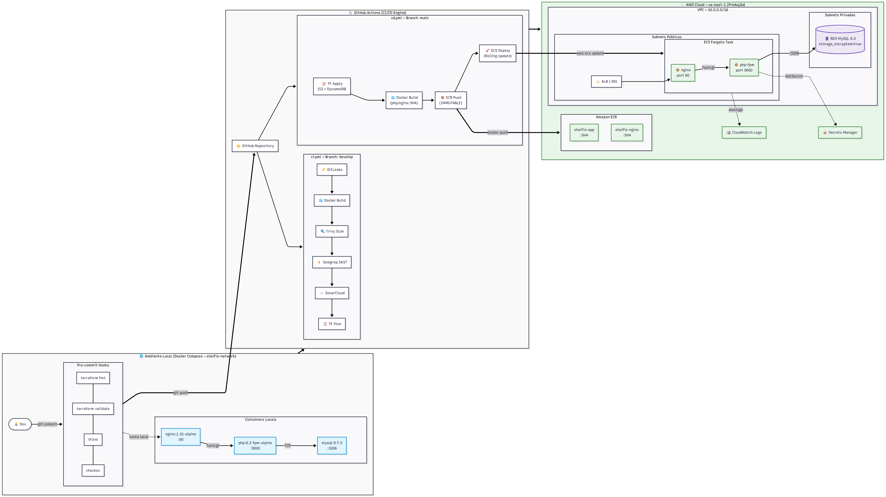
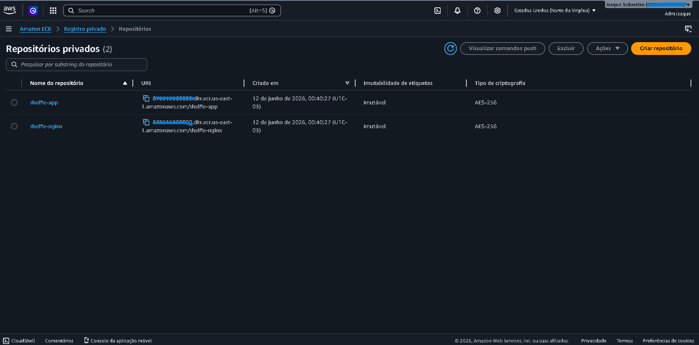
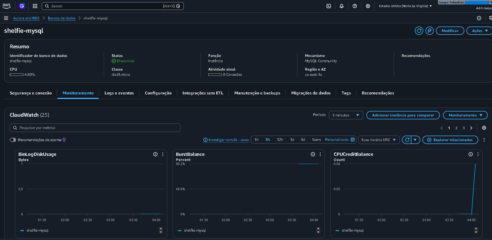
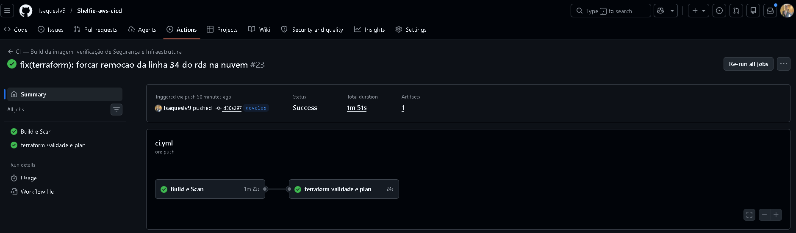
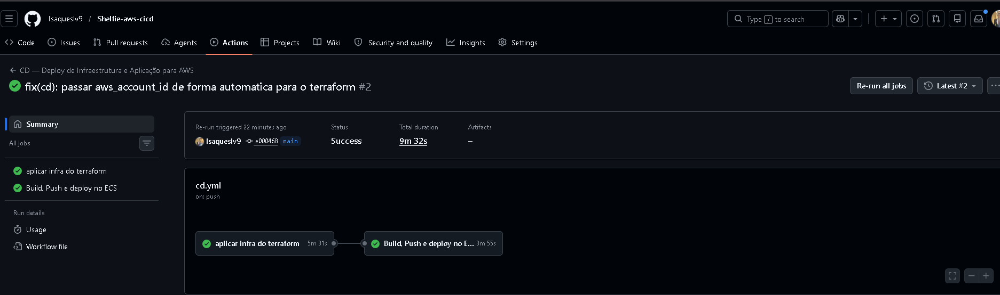

# Shelfie — Deploy Completo com DevSecOps e IaC na AWS

Projeto pessoal de estudo com foco em containerização, infraestrutura como código (IaC), deploy em nuvem e automação com CI/CD.  
A aplicação é um gerenciador de estante de livros com autenticação, CRUD completo e estatísticas de leitura.

---

## Stack

| Tecnologia | Função |
|---|---|
| PHP 8.2 + Nginx | Aplicação |
| MySQL 9.7 | Banco de dados local |
| Docker & Docker Compose | Containerização e orquestração local |
| Terraform 1.8.0 | Infraestrutura como Código (IaC) |
| Amazon ECR | Registry de imagens (tags imutáveis por SHA) |
| Amazon ECS | Orquestração de containers na nuvem |
| Amazon RDS | Banco de dados gerenciado |
| Amazon ALB | Load Balancer |
| AWS Secrets Manager | Gerenciamento de credenciais do banco |
| CloudWatch | Logs e alarmes |
| GitHub Actions | Pipeline CI/CD |
| GitLeaks | Scan de segredos no código e histórico Git |
| Trivy | Scan de vulnerabilidades nas imagens Docker |
| Semgrep | Análise estática de código (SAST) |
| SonarCloud | Qualidade de código (Code Quality Gate) |
| Checkov + tflint | Segurança e boas práticas no código Terraform |

---

# Arquitetura Geral do Ecossistema

Para garantir um ciclo de desenvolvimento moderno, seguro e escalável, o projeto **Shelfie** foi desenhado separando as responsabilidades entre o ambiente de desenvolvimento local (Docker Compose) e o ambiente de produção serverless na nuvem.

## Esteira de Integração e Entrega Contínua (CI/CD)

O fluxo de implantação automatizada (GitOps) na branch principal segue o pipeline linear e seguro detalhado abaixo:



---

### Estratégia de Branching (GitFlow)

A esteira de automação é orientada ao comportamento das branches do repositório, garantindo que nenhum código quebre a produção:

| Branch | Pipeline | Escopo | Ação |
|---|---|---|---|
| `develop` | `ci.yml` | Integração Contínua (CI) | Build de teste, scans de segurança, SonarCloud, validação e plan do Terraform — **Sem deploy**. |
| `main` | `cd.yml` | Entrega Contínua (CD) | Terraform apply, build com tag SHA, push para ECR e **Deploy automático no ECS Fargate**. |

**Fluxo de Trabalho:**
`develop` ➔ *Pull Request (Aprovação)* ➔ `main` ➔ *Deploy em Produção (AWS)*


### Práticas de DevSecOps Aplicadas no Pipeline:
* **Scan de Secrets:** `GitLeaks` escaneia o histórico completo do Git impedindo vazamento de chaves e credenciais.
* **Análise de Vulnerabilidades (SCA):** `Trivy` bloqueando o build caso as imagens base do PHP ou Nginx contenham vulnerabilidades de nível *CRITICAL* ou *HIGH*.
* **Análise Estática de Código (SAST):** `Semgrep` validando as boas práticas do código PHP contra o OWASP Top 10 antes do deploy.
* **Qualidade de Código:** `SonarCloud` com Quality Gate verificando bugs, vulnerabilidades e code smells.
* **Segurança de IaC:** `Checkov` e `tflint` via pre-commit hooks verificando misconfigurations no Terraform antes de qualquer push.

---

## Fase 1 — Containerização com Docker

A aplicação originalmente rodava em XAMPP com phpMyAdmin. O objetivo desta fase foi containerizá-la do zero utilizando Docker puro.

### Arquitetura local

```
┌─────────────┐       ┌─────────────┐       ┌─────────────┐
│    Nginx     │──────▶│  PHP-FPM    │──────▶│    MySQL    │
│  (proxy)    │       │   (app)     │       │    (db)     │
│   porta 80  │       │  porta 9000 │       │  porta 3306 │
└─────────────┘       └─────────────┘       └─────────────┘
                        shelfie-network
```

### O que foi feito

- Dockerfile com imagem `php:8.2-fpm-alpine`, instalação de `pdo_mysql`, usuário não-root (`appuser`) com least privilege e healthcheck via `php-fpm -t`
- Docker Compose orquestrando 3 serviços: `nginx`, `app` e `db`
- Rede interna `shelfie-network` isolando os containers
- Volume nomeado `db_data` para persistência do MySQL
- Healthcheck no MySQL com `mysqladmin ping` e `start_period` para evitar race condition na inicialização
- `depends_on` com `condition: service_healthy` garantindo ordem de subida: `db → app → nginx`
- Variáveis de ambiente via `.env` — credenciais fora do código
- Porta do banco não exposta externamente
- Schema e seed do banco via `init.sql` executado automaticamente na inicialização do container

---

## Fase 2 — Amazon ECR

As imagens Docker foram enviadas para o Amazon ECR para serem utilizadas pelo ECS.

Dois repositórios criados via Terraform com `image_tag_mutability = IMMUTABLE` — cada imagem é tagueada com o SHA do commit, impedindo sobrescrita acidental:
- `shelfie-app` — imagem PHP-FPM
- `shelfie-nginx` — imagem Nginx



---

## Fase 3 — Amazon ECS

A aplicação foi deployada no Amazon ECS utilizando AWS Fargate como infraestrutura, eliminando a necessidade de gerenciar servidores EC2.

### Configuração

- **Cluster:** `shelfie-cluster` com Container Insights habilitado
- **Task Definition:** `shelfie-task` com dois containers (`shelfie-nginx` + `shelfie-app`)
- **CPU:** 0.5 vCPU | **Memória:** 1GB
- **Subnets:** públicas da VPC provisionada pelo Terraform
- **Security Group:** porta 80 liberada apenas via ALB
- **Load Balancer:** ALB com health check na raiz `/`
- **Credenciais do banco:** injetadas via AWS Secrets Manager (sem senha em variável de ambiente)

### Problema Encontrado Durante o Deploy no ECS

Durante o deploy da aplicação PHP no Amazon ECS utilizando AWS Fargate, a aplicação não respondia ao acessar o IP público da Task.

Inicialmente, apenas o container da aplicação PHP (`php:8.2-fpm-alpine`) foi enviado para o Amazon ECR e utilizado na Task Definition. O problema é que o `php-fpm` não funciona como servidor web HTTP — ele apenas processa arquivos PHP internamente.

No ambiente local, a aplicação funcionava corretamente porque o Docker Compose utilizava dois containers: Nginx e PHP-FPM. O Nginx era responsável por receber as requisições HTTP e encaminhá-las para o PHP-FPM. No ECS, como apenas o container PHP foi utilizado, não existia nenhum servidor web para responder às requisições externas.

A solução foi ajustar a arquitetura para utilizar dois containers na mesma Task Definition: `shelfie-nginx` e `shelfie-app`. O container Nginx passou a expor a porta `80`, enquanto o container PHP-FPM permaneceu utilizando a porta `9000`.

Como os containers da mesma Task compartilham a rede no ECS, o Nginx conseguiu se comunicar corretamente com o PHP-FPM através do `127.0.0.1:9000`. Após recriar a imagem do Nginx, realizar novo push para o Amazon ECR e atualizar a Task Definition no ECS, a aplicação passou a responder corretamente via navegador.


---

## Fase 4 — Amazon RDS

O banco de dados foi migrado do container local para o Amazon RDS, tornando-o um serviço gerenciado e independente dos containers.

### Configuração

- **Engine:** MySQL 8.0
- **Instância:** db.t3.micro
- **VPC:** mesma VPC do ECS, provisionada pelo Terraform
- **Subnets:** privadas (banco não acessível pela internet)
- **Security Group:** porta 3306 liberada apenas para o Security Group do ECS
- **Criptografia:** `storage_encrypted = true`
- **Credenciais:** gerenciadas automaticamente pelo AWS Secrets Manager via `manage_master_user_password`

### Migração

O `init.sql` com o schema e seed foi executado diretamente no RDS após a criação. O endpoint do RDS é injetado como variável de ambiente na Task Definition do ECS.



---

## Fase 5 — Infraestrutura como Código (Terraform)

Toda a infraestrutura AWS é provisionada e versionada via Terraform, com state remoto no S3 e lock via DynamoDB.

```
infra/
├── backend.tf          # S3 backend + DynamoDB state lock
├── main.tf             # Orquestração dos módulos
├── variables.tf        # Variáveis raiz
├── outputs.tf          # Outputs (ECR URLs, ALB DNS, etc.)
└── modules/
    ├── network/        # VPC, subnets, IGW, Security Groups
    ├── ecr/            # Repositórios ECR (IMMUTABLE)
    ├── iam/            # Roles ECS + policy Secrets Manager
    ├── rds/            # RDS MySQL com Secrets Manager
    └── ecs/            # Cluster, Task Definition, Service, ALB, CloudWatch
```

---

## Fase 6 — GitHub Actions (CI/CD)

Pipeline de deploy automatizado com dois estágios independentes por branch.

### CI — Validação e Segurança (develop)

```
push na develop → GitLeaks scan → build PHP + Nginx →
Trivy scan PHP → Trivy scan Nginx → Semgrep SAST →
SonarCloud Quality Gate → Terraform fmt + validate + plan
```

### CD — Deploy ECR e ECS (main)

```
push na main → Terraform apply → build PHP:SHA + Nginx:SHA →
push para ECR → force new deployment no ECS
```

### DevSecOps — Camadas de Segurança

**GitLeaks — Secret Scan**  
Escaneia o histórico completo do Git (`fetch-depth: 0`) impedindo vazamento de credenciais e chaves.

**Semgrep — SAST**  
Análise estática do código PHP a cada push na branch develop com as regras:
- `p/php` → vulnerabilidades específicas da linguagem PHP
- `p/secrets` → detecção de secrets hardcoded
- `p/owasp-top-ten` → validação baseada no OWASP Top 10

**Trivy — Container Security**  
Scan automático de vulnerabilidades nas imagens `shelfie-app` e `shelfie-nginx`. A pipeline é bloqueada automaticamente caso sejam encontradas vulnerabilidades classificadas como HIGH ou CRITICAL.

**SonarCloud — Code Quality**  
Quality Gate verificando bugs, vulnerabilidades, code smells e duplicações no código PHP.

**Checkov + tflint — IaC Security**  
Pre-commit hooks verificando misconfigurations e boas práticas no código Terraform antes de qualquer push.

## GitHub Actions Pipeline




### Secrets configurados no GitHub

| Secret | Descrição |
|---|---|
| `AWS_ACCESS_KEY_ID` | Chave de acesso AWS |
| `AWS_SECRET_ACCESS_KEY` | Chave secreta AWS |
| `AWS_REGION` | Região AWS |
| `AWS_ACCOUNT_ID` | ID da conta AWS |
| `ECR_REGISTRY` | URI do registry ECR |
| `ECR_REPOSITORY_APP` | Nome do repositório PHP |
| `ECR_REPOSITORY_NGINX` | Nome do repositório Nginx |
| `ECS_CLUSTER` | Nome do cluster ECS |
| `ECS_SERVICE` | Nome do service ECS |
| `SONAR_TOKEN` | Token de autenticação SonarCloud |

---

## Boas práticas aplicadas

- Least privilege — container `app` roda com usuário `appuser`, não root
- Credenciais do banco gerenciadas pelo AWS Secrets Manager (sem senha em variável de ambiente)
- Imagens Docker tagueadas por SHA de commit com mutabilidade IMMUTABLE no ECR
- Infraestrutura 100% versionada em Terraform com state remoto e lock
- Security Group do RDS liberado apenas para o SG do ECS
- Banco de dados em subnets privadas, sem acesso externo
- Volume nomeado para persistência dos dados locais
- Healthcheck nos containers garantindo ordem de inicialização
- Pre-commit hooks bloqueando push com código Terraform mal formatado ou inseguro

---

## Roadmap

- [x] Fase 1 — Containerização com Docker
- [x] Fase 2 — Amazon ECR
- [x] Fase 3 — Amazon ECS Fargate
- [x] Fase 4 — Amazon RDS MySQL
- [x] Fase 5 — Infraestrutura como Código (Terraform)
- [x] Fase 6 — CI/CD com GitHub Actions e DevSecOps
- [ ] Projeto 2 — EKS + GitLab CI

---
